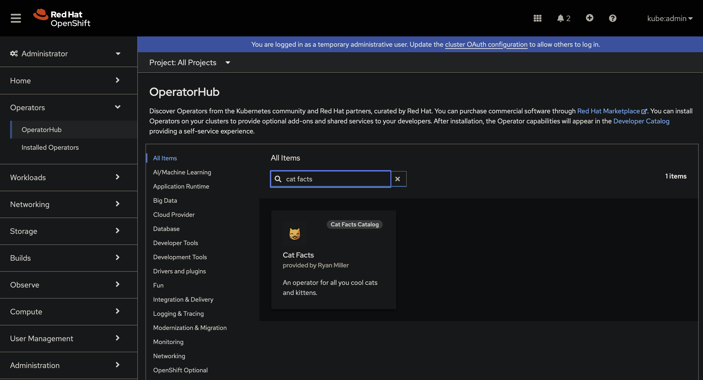
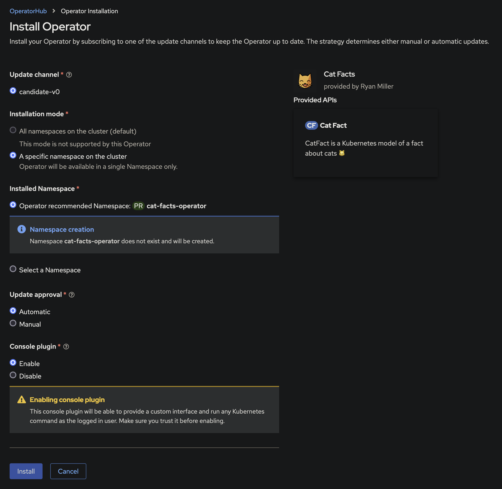

# Cat Facts OLM Catalog

Install Cat Facts Operator on OpenShift through Operator Lifecycle Manager
(OLM). This repo contains code to build an OLM *file-based catalog* that
includes the bundle for the Cat Facts Operator.

## How to Install Cat Facts from this Catalog

1. Create a CatalogSource: `oc create -f catalog-source.yaml`
2. Navigate to *Operators > OperatorHub* in the OpenShift console
3. Search for *Cat Facts* (It may take up to a minute for the CatalogSource to be ready)

4. Install the operator
    * **Make sure to check *Enabled* for *Console plugin*!** Otherwise you won't install the Cat Facts UI.

5. Within 1 minute after the installation completes, you will be prompted to
   refresh your OpenShift console in the top-right corner.

## How to Use Cat Facts

1. Navigate to *Cat Facts > Cat Fact Catalog* in the OpenShift console
2. Click *Create CatFact*

## Acknowledgments

Cat emoji used for catalog icon was created by Emily Jäger, licensed under
[CC BY-SA 4.0] and is [available here][cat-emoji].

[CC BY-SA 4.0]: https://creativecommons.org/licenses/by-sa/4.0
[cat-emoji]: https://openmoji.org/library/emoji-1F638
